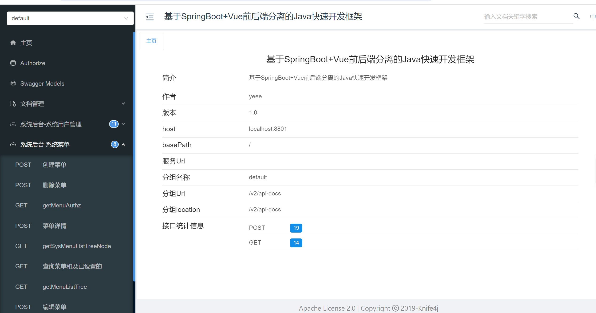
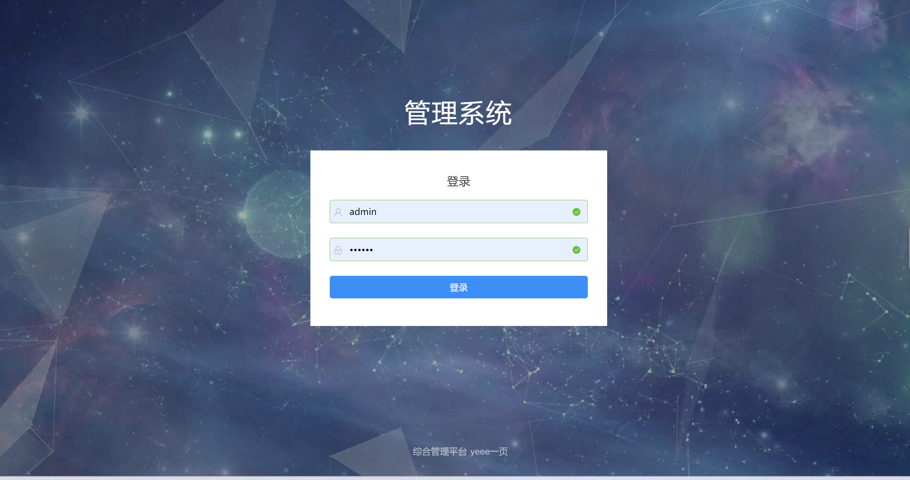
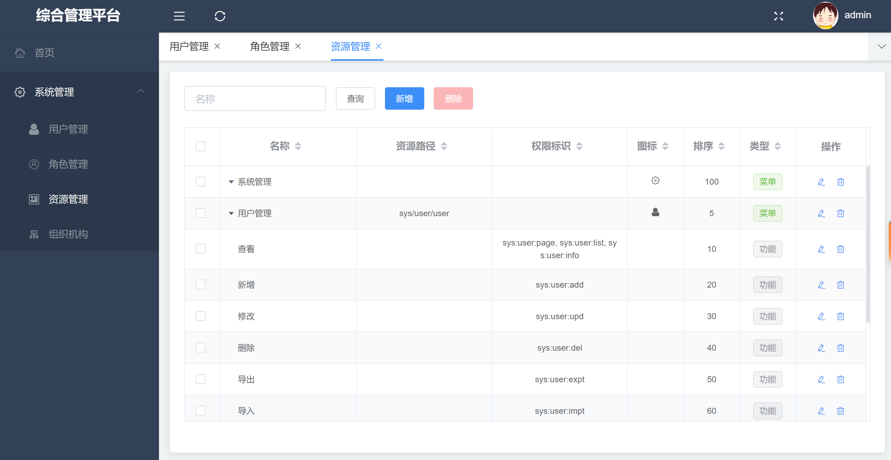
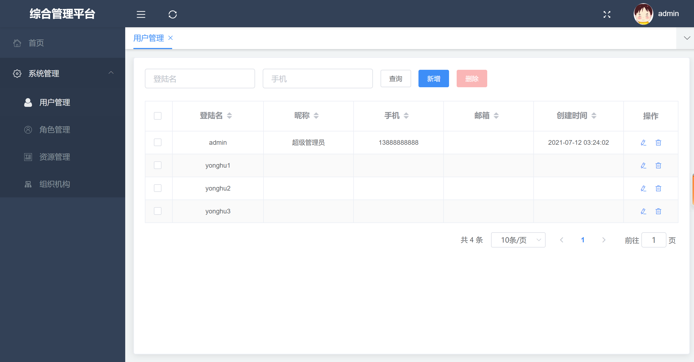
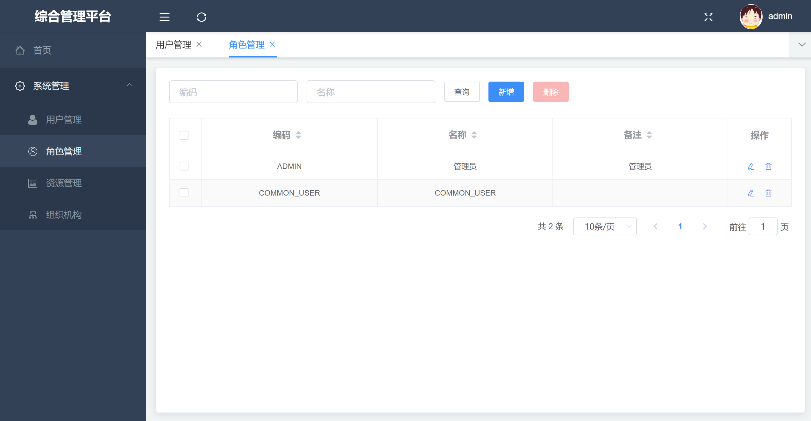
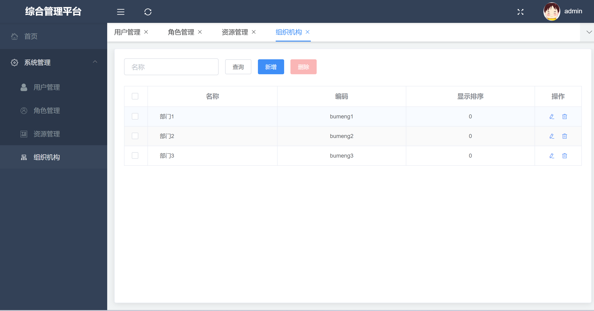

## 系统说明

- 基于SpringBoot+Vue前后端分离的Java快速开发框架
- 轻量级 + 组件化 + 可扩展

## 系统介绍

- 前后端分离Springboot + Vue
- 使用SpringSecurity + Oauth2 + Jwt做权限认证
- 在线文档使用Knife4j

## 功能演示

<table>
    <tr>
        <td></td>
        <td></td>
    </tr>
    <tr>
        <td></td>
        <td></td>
    </tr>
    <tr>
        <td></td>
        <td></td>
    </tr>
</table>

## 快速开始

### 核心依赖

| 依赖                          | 版本                                                   |
|-----------------------------|------------------------------------------------------|
| Spring Boot                 | 2.6.3                                                |
| yeee-memo                   | [通用web脚手架](https://gitee.com/yeeevip/yeee-memo.git) |

### 模块说明

```lua
yeee-springboot-vue
├── app-h5
    ├── yeee-admin-ui -- 管理系统｜vue
├── doc -- 文档脚本
├── yeee-app-bootstrap -- 主启动工程
├── yeee-app-common -- 公共模块
├── yeee-sys-manage -- 系统权限管理服务
```

### 本地开发 运行

#### 环境要求

- Jdk1.8
- Mysql >= 5.7
- NodeJs v16.20.2

```
# 下载yeee-memo脚手架工程
git clone https://gitee.com/yeeevip/yeee-memo.git

# 打包编译[JavaWeb通用脚手架]
cd yeee-memo/memo-parent && mvn clean install

# 下载yeee-springboot-vue项目
git clone https://gitee.com/yeeevip/yeee-springboot-vue.git

# 启动springboot项目
cd yeee-springboot-vue && mvn clean install && java -jar yeee-app-bootstrap/target/yeee-app-bootstrap-1.0.0-SNAPSHOT.jar

# 运行管理端ui
cd yeee-springboot-vue/app-h5/yeee-admin-ui && npm install --registry=https://registry.npmmirror.com && npm run dev
```

### 其他说明

1. 欢迎提交 [PR](https://www.yeee.vip)

2. 欢迎提交 [issue](https://github.com/yeeevip/yeee-springboot-vue/issues)，请写清楚遇到问题的原因、开发环境、复显步骤。

## 交流群

- 作者QQ：1324459373

| 微信群                             | QQ群                                                                           |
|---------------------------------|-------------------------------------------------------------------------------|
|  |                                               |
| 回复：加群，邀您加入群聊                    | <a href="https://qm.qq.com/q/oLSCm1Ksjm" target="_blank">点击加入QQ群：96305921</a> |

